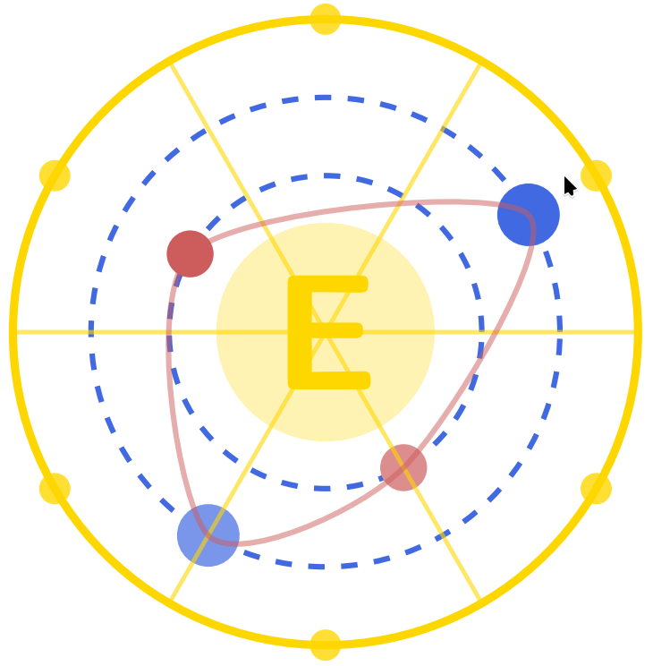

<div align="center">



# Elder Theory

A novel mathematical framework for multi-domain learning and knowledge representation

[](https://github.com/ykashou/latex-elder-theory)
[](./LICENSE)
[](https://www.tug.org/texlive/)
[](./build/theory/elder_arcane_realization.pdf)

[Theory PDF](./build/theory/elder_arcane_realization.pdf) • [Student Workbook](./build/student_workbook/workbook.pdf) • [Documentation](./docs) • [Report Issue](https://github.com/ykashou/latex-elder-theory/issues)

</div>

## 📚 About

**"Elder Theory: The Arcane Realization"** is a comprehensive mathematical textbook that introduces a theoretical framework for hierarchical knowledge representation and multi-domain learning. The book presents the **Elder-Mentor-Erudite system**, which models how learning occurs at different levels of abstraction through orbital dynamics and gravitational interactions.

### Key Concepts:

- **Elder Spaces** - Novel mathematical structures with phase operators and gravitational fields
- **Heliomorphic Functions** - Generalization of holomorphic functions with learning properties
- **Hierarchical Learning** - Multi-level knowledge representation (Elder-Mentor-Erudite)
- **Orbital Mechanics** - Knowledge transfer through gravitational resonance
- **O(1) Memory** - Theoretical framework achieving constant memory complexity

## 🎯 Features

- ✅ **Rigorous Mathematical Theory** - 934 pages of publication-ready proofs and theorems
- ✅ **Student Workbook** - 37-page companion with worked examples and exercises
- ✅ **Teaching Guide** - Instructor resources with lecture notes and rubrics
- ✅ **Complete Notation System** - Consistent mathematical macros throughout
- ✅ **Container-Based Builds** - No local LaTeX installation required
- ✅ **Modular Structure** - Theory, teaching materials, and student resources organized separately

## 🛠 Tech Stack

- **Typesetting**: LaTeX (TeX Live 2025)
- **Engine**: LuaLaTeX
- **Bibliography**: Biber (biblatex)
- **Diagrams**: TikZ + PGFPlots
- **Containerization**: Podman with official TeX Live image
- **Build System**: GNU Make
- **Version Control**: Git

## 📋 Prerequisites

- **Podman** >= 4.0 (or Docker)
- **GNU Make** (usually pre-installed)
- **No LaTeX installation needed!** (uses container)

## 🚦 Quick Start

### Build Theory Document (Recommended)

```bash
# Clone repository
git clone https://github.com/ykashou/latex-elder-theory.git
cd latex-elder-theory

# Build main theory document (~5-10 minutes)
make theory

# View result
open build/theory/elder_arcane_realization.pdf
```

**Output**: 934-page PDF with complete theory (4.2 MB)

### Build All Documents

```bash
# Build everything
make theory              # Main theory document
make student_workbook    # Student workbook
make teaching_guide      # Teaching guide

# Or see all options
make help
```

## 📁 Repository Structure

```
latex-elder-theory/
├── theory/                    # 📘 Main Mathematical Theory
│   ├── main.tex              # Document entry point
│   ├── chapters/             # All chapter content
│   │   ├── part1_theory/     # Theoretical foundations (Units I-VII)
│   │   │   ├── unit1_foundation_layer/
│   │   │   ├── unit2_heliomorphic_functions_and_geometry/
│   │   │   ├── unit3_elder_heliosystem_architecture/
│   │   │   ├── unit4_learning_dynamics_and_algorithms/
│   │   │   ├── unit5_cross_domain_knowledge_transfer/
│   │   │   ├── unit6_theoretical_unification_and_closure/
│   │   │   └── unit7_memory_and_efficiency_properties/
│   │   ├── part2_experiments/ # Empirical validation (Units I-III)
│   │   └── appendix/         # Advanced proofs and references
│   └── bibliography.bib      # Bibliography references
│
├── student_workbook/          # 🎓 Student Learning Materials
│   ├── README.md             # Student resources overview
│   └── chapter1/             # Chapter 1 materials
│       ├── workbook.tex      # Regular workbook
│       ├── workbook_enhanced.tex  # Enhanced version
│       ├── study_book.tex    # Study book
│       └── components/       # Workbook parts
│
├── teaching_guide/            # 👨‍🏫 Instructor Resources
│   ├── README.md             # Teaching guide overview
│   ├── chapter1_guide.tex    # Chapter 1 instructor guide
│   ├── lecture_notes/        # Lecture materials
│   ├── assessment_rubrics/   # Grading criteria
│   └── solutions_manual/     # Complete solutions
│
├── shared/                    # 🔧 Common Resources
│   ├── macros/               # LaTeX macros and commands
│   │   ├── math_macros.tex   # Mathematical notation
│   │   ├── tikz_styles.tex   # TikZ diagram styles
│   │   └── chapter_summary.tex # Summary templates
│   ├── figures/              # Diagrams and illustrations
│   └── examples/             # Code examples and algorithms
│
├── build/                     # 📦 Build Outputs (gitignored)
│   ├── theory/               # Theory PDF output
│   ├── teaching_guide/       # Teaching guide output
│   └── student_workbook/     # Workbook outputs
│
├── docs/                      # 📝 Documentation
│   ├── annotations/          # Annotation tracking
│   ├── reviews/              # Chapter reviews
│   └── archive/              # Archived planning docs
│
├── scripts/                   # 🔨 Build and Automation Scripts
├── assets/                    # 🎨 Static Assets
├── tests/                     # 🧪 Test Files
├── Makefile                   # Build system
└── README.md                  # This file
```

## 🏗️ Building the Documents

### Method 1: Using Make (Recommended)

The easiest way to build PDFs using the container:

```bash
# Main theory document (5-10 minutes, 934 pages)
make theory

# Student workbook (1 minute, 37 pages)
make student_workbook

# Teaching guide (1 minute, 5 pages)
make teaching_guide

# Clean auxiliary files
make clean

# Clean everything including PDFs
make realclean

# Show all options
make help
```

### Method 2: Direct Container Commands

```bash
# Theory document (if Make is unavailable)
podman run --rm -v $(pwd):/workspace:Z -w /workspace \
  docker.io/texlive/texlive:latest \
  bash -c "cd theory && \
    lualatex --interaction=nonstopmode --output-directory=../build/theory main.tex && \
    cd ../build/theory && biber main && cd ../../theory && \
    makeindex ../build/theory/main.idx && \
    lualatex --interaction=nonstopmode --output-directory=../build/theory main.tex && \
    lualatex --interaction=nonstopmode --output-directory=../build/theory main.tex && \
    lualatex --interaction=nonstopmode --output-directory=../build/theory main.tex && \
    lualatex --interaction=nonstopmode --output-directory=../build/theory main.tex && \
    cp ../build/theory/main.pdf ../build/theory/elder_arcane_realization.pdf"
```

**For Docker**: Replace `podman` with `docker` and remove `:Z` SELinux label.

## 📦 Build Outputs

After successful compilation:

| Document | File | Pages | Size | Build Time |
|----------|------|-------|------|------------|
| **Theory** | `build/theory/elder_arcane_realization.pdf` | 934 | 4.2 MB | 5-10 min |
| **Workbook** | `build/student_workbook/workbook.pdf` | 37 | 245 KB | 1 min |
| **Teaching Guide** | `build/teaching_guide/chapter1_guide.pdf` | 5 | 70 KB | 1 min |

### Theory Document Contents:

- ✅ Table of Contents
- ✅ List of Figures (133 entries)
- ✅ List of Tables (103 entries)
- ✅ Part I: Theory (7 Units, 896 pages)
  - Unit I: Foundation Layer
  - Unit II: Heliomorphic Functions and Geometry
  - Unit III: Elder Heliosystem Architecture
  - Unit IV: Learning Dynamics and Algorithms
  - Unit V: Cross-Domain Knowledge Transfer
  - Unit VI: Theoretical Unification and Closure
  - Unit VII: Memory and Efficiency Properties
- ✅ Part II: Experiments (3 Units)
- ✅ Appendices (Glossary, Notation, Advanced Proofs)
- ✅ Bibliography
- ✅ Index

## 🎓 Student Resources

### Student Workbook

Pedagogical companion with:
- 15+ worked examples with complete arithmetic steps
- 10+ practice exercises with detailed solutions
- Intuition boxes explaining abstract concepts
- Formula reference sheets
- Calculation checklists
- Common mistakes appendix

**Location**: `student_workbook/chapter1/workbook.tex`  
**Build**: `make student_workbook`

### Alternative Versions

- **Enhanced Workbook**: `student_workbook/chapter1/workbook_enhanced.tex` (50 pages)
- **Study Book**: `student_workbook/chapter1/study_book.tex` (82 pages)

Build manually when needed (see `student_workbook/README.md`).

## 👨‍🏫 Teaching Resources

### For Instructors

The teaching guide provides:
- Lecture notes with pacing suggestions
- Assessment rubrics for grading
- Complete solutions manuals
- Discussion prompts
- Learning objectives per chapter
- Common student misconceptions

**Status**: 🚧 Under development  
**Location**: `teaching_guide/`

## 📝 Content Guidelines

### For Theory Document:

- Maintain mathematical rigor with formal definitions, theorems, and proofs
- Follow ruleset in `.cursor/rules/` for consistency
- Include complete proofs (no "proof sketches")
- Add dependency comments to all theorems
- Use macros from `shared/macros/math_macros.tex` consistently
- Add new terms to glossary and index

### For Student Workbooks:

- Show all arithmetic steps explicitly
- Use concrete numerical values (not just variables)
- Provide intuition before formal calculations
- Include interpretations of results
- Progressive difficulty (beginner → advanced)
- Self-contained sections

See `.cursor/rules/` for detailed guidelines.

## 🔧 Customization

### Mathematical Notation

Custom notation is defined in `shared/macros/math_macros.tex`:

```latex
\elder{d}         % Elder space of dimension d
\mentor{k}        % Mentor space
\erudite{n}       % Erudite space
\elderloss        % Elder loss function
\helio            % Heliomorphic function space
```

### Adding New Chapters

1. Create `.tex` file in appropriate `theory/chapters/` subdirectory
2. Add `\input{}` command in `theory/main.tex`
3. Follow established chapter structure
4. Use `\chaptersummary{}` template
5. Add to table of contents

### Creating New Workbooks

See `.cursor/rules/student-workbook-guidelines.mdc` for comprehensive guidelines.

## 🧪 Testing

```bash
# Compile test documents
cd tests/
make test

# Check for LaTeX errors
grep "Error" build/theory/main.log

# Verify cross-references
grep "undefined" build/theory/main.log
```

## ⚠️ Troubleshooting

### Common Issues:

**Issue**: `podman: command not found`  
**Solution**: Install podman or use docker (replace `podman` with `docker` in commands)

**Issue**: "Too deeply nested" errors  
**Solution**: These are in appendix files, not core chapters. PDF still generates successfully.

**Issue**: Missing bibliography entries  
**Solution**: Ensure `theory/bibliography.bib` exists. Some citations may reference future work.

**Issue**: Permission errors with containers (SELinux)  
**Solution**: Add `:Z` flag for Podman on SELinux systems (Fedora/RHEL): `-v $(pwd):/workspace:Z`

**Issue**: Incomplete List of Figures/Tables  
**Solution**: Ensure all 5 LaTeX passes complete (this is automated in `make theory`)

## 🤝 Contributing

### For Mathematical Content:

1. Fork the repository
2. Create branch following convention:
   - `feature/unit-X-chapter-Y` for new chapters
   - `fix/annotation-XX` for addressing annotations
   - `docs/chapter-X-review` for documentation
3. Follow mathematical rigor rules (see `.cursor/rules/`)
4. Ensure document compiles: `make theory`
5. Update notation appendix if adding new symbols
6. Submit pull request with detailed description

### For Student Materials:

1. Follow workbook guidelines in `.cursor/rules/`
2. Include complete worked solutions
3. Test compilation: `make student_workbook`
4. Verify all arithmetic steps shown

### For Teaching Resources:

1. Add to `teaching_guide/` directory
2. Include learning objectives
3. Provide assessment rubrics
4. Follow LaTeX styling conventions

## 📖 Documentation

### Key Documents:

- **Annotation System**: `docs/annotation_implementation_checklist.md`
- **Theorem Dependencies**: See dependency tracking in `.cursor/rules/`
- **Content Organization**: Theory vs Experiments guidelines
- **Mathematical Rigor**: Proof validation requirements
- **Notation Consistency**: Symbol usage rules

### Build System:

- **Makefile**: Container-based builds for all documents
- **Scripts**: `scripts/` directory contains automation tools
- **Rules**: `.cursor/rules/` contains quality guidelines

## 🎨 Features in Detail

### Mathematical Rigor

Every theorem includes:
- ✅ Complete formal proofs (no sketches)
- ✅ Explicit dependency tracking
- ✅ All assumptions stated upfront
- ✅ Edge cases addressed
- ✅ Counterexamples when needed

### Notation System

- ✅ Consistent macros across 934 pages
- ✅ Consolidated notation appendix
- ✅ Symbol glossary with page references
- ✅ Index of terms

### Visual Elements

- ✅ 133 figures (TikZ diagrams)
- ✅ 103 tables (data and comparisons)
- ✅ Colored theorem environments
- ✅ Chapter summaries in styled boxes

## 🚀 Advanced Usage

### Editing Content

```bash
# Edit theory chapters
vim theory/chapters/part1_theory/unit1_foundation_layer/introduction_to_elder_spaces.tex

# Rebuild
make theory

# Quick rebuild (skip bibliography/index)
podman run --rm -v $(pwd):/workspace:Z -w /workspace \
  docker.io/texlive/texlive:latest \
  bash -c "cd theory && lualatex --output-directory=../build/theory main.tex"
```

### Adding New Macros

```bash
# Edit shared macros
vim shared/macros/math_macros.tex

# Add to notation appendix
vim theory/chapters/appendix/consolidated_notation.tex

# Rebuild to verify
make theory
```

### Working with Figures

```bash
# Add new TikZ figure
vim shared/figures/new_category/new_diagram.tex

# Reference in chapter
# \input{../../shared/figures/new_category/new_diagram.tex}

# Rebuild
make theory
```

## 📊 Repository Statistics

### Content Scale:

- **Theory Chapters**: 108 .tex files
- **Total Pages**: 934 (theory) + 37 (workbook) + 5 (teaching) = 976 pages
- **Figures**: 133 diagrams across 18 categories
- **Tables**: 103 data tables
- **Theorems**: 100+ proven theorems
- **Proofs**: Complete, rigorous proofs throughout

### Build Complexity:

- **LaTeX Passes**: 5 (for complete cross-references and lists)
- **Compilation Time**: ~5-10 minutes (theory), ~1 minute (workbooks)
- **Dependencies**: Bibliography (biber), Index (makeindex), Cross-references

## 🌟 Use Cases

### For Students:

1. Read theory document for formal mathematics
2. Work through student workbook for practice
3. Attempt exercises before checking solutions
4. Build intuition with worked examples

### For Researchers:

1. Study theoretical framework (Part I)
2. Examine experimental validation (Part II)
3. Reference notation appendix
4. Cite theorems and definitions

### For Instructors:

1. Use theory as textbook
2. Assign workbook exercises
3. Reference teaching guide for lecture planning
4. Use assessment rubrics for grading

### For Implementers:

1. Study algorithmic specifications (Unit IV)
2. Reference complexity bounds (Unit VII)
3. Examine implementation examples (Part II)
4. Use as specification for Elder system implementation

## 📄 License

Copyright © 2025 by Yanal Luay Kashou.

This work is licensed under the **Elder License** - an open-source license permitting reproduction, distribution, and transmission with attribution.

See [LICENSE](LICENSE) file for complete terms.

## 🙏 Acknowledgments

- The mathematical community for foundational theories
- Complex analysis and operator theory traditions
- Machine learning research inspiring novel frameworks
- All who seek to understand dynamic knowledge representation

## 📮 Contact

- **Author**: Yanal Luay Kashou
- **Email**: yanal.kashou@gmail.com
- **GitHub**: [@ykashou](https://github.com/ykashou)
- **Issues**: [Report bugs or request features](https://github.com/ykashou/latex-elder-theory/issues)

## 🔗 Related Resources

- **Elder Labs**: https://elder.labs (theoretical foundation)
- **Research Papers**: (to be published)
- **Implementation**: (to be open-sourced)

---

<div align="center">

**Made with <3 and mathematical rigor by [Yanal Luay Kashou](https://github.com/ykashou)**

*Dedicated to all who seek to understand the fundamental principles of dynamic knowledge representation*

</div>
